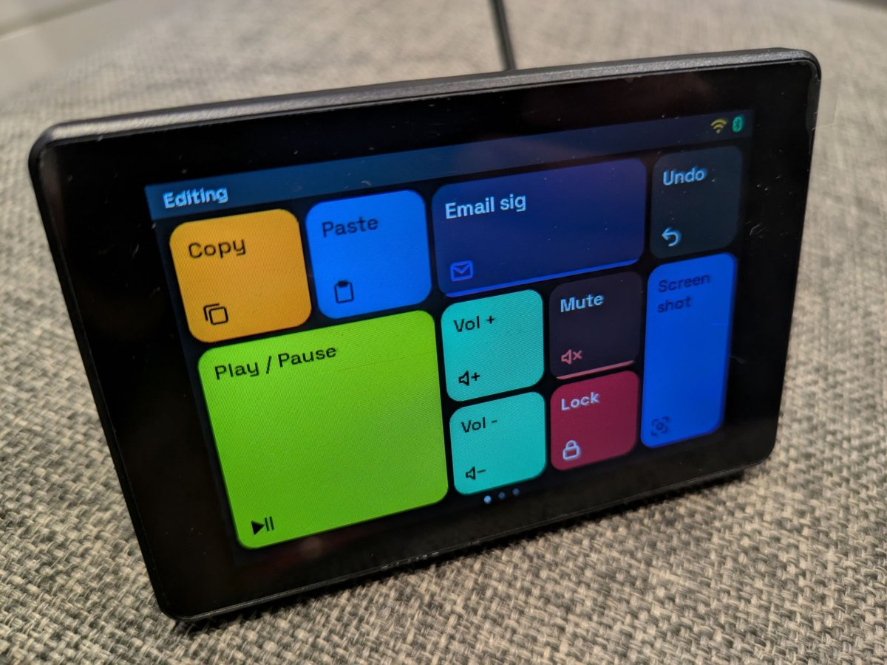
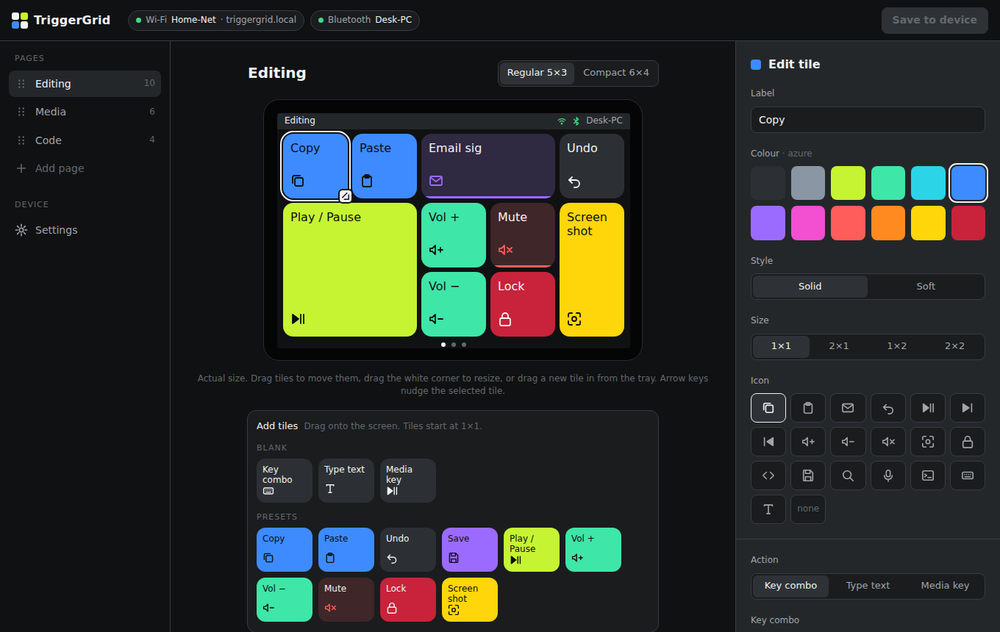

# TriggerGrid

A touchscreen Bluetooth macro pad built on the **Guition JC3248W535** (ESP32-S3 with a 3.2″ 480×320
touch display).

<p align="center">
  
</p>
<p align="center"><sub>The finished pad. Compare it with the <a href="docs/images/screen-mockup.svg">design mockup</a> drawn
from the <a href="docs/style-guide.md">style guide</a> numbers (<code>python3 tools/make_mockup.py</code>).</sub></p>

- Tap a tile to send a **key combo**, **type a snippet**, or press a **media key**. The pad shows
  up on your computer as a normal Bluetooth keyboard, so there is nothing to install.
- Rounded **bento tiles** in a compact grid, across multiple pages you swipe between.
- Set up the tiles from your **browser**. The pad joins your home Wi-Fi (`http://triggergrid.local`)
  or creates its own hotspot if it can't.

<p align="center">
  
</p>
<p align="center"><sub>Web config page mockup. Try the clickable version in <a href="docs/mockups/README.md">docs/mockups</a>.</sub></p>

This repo is also the reference project for a blog series about programming this board with
**VS Code, PlatformIO, LVGL and Claude**. Each milestone in the roadmap is tagged so you can
check out the code as it was at any step.

> **Status:** M0–M9 are done and checked on the board: it renders, swipes, types over Bluetooth and
> is configured from the web page. M10 (polish) is checked too, except updating the firmware from the web page. See the
> [roadmap](docs/roadmap.md).

## Hardware

| Part     | Detail |
|----------|--------|
| Board    | Guition JC3248W535 |
| SoC      | ESP32-S3, dual core 240 MHz, 16 MB flash, 8 MB PSRAM |
| Display  | 3.2″ IPS 320×480 (used as 480×320 landscape), AXS15231B over QSPI |
| Touch    | Capacitive, AXS15231B over I2C |
| Power    | USB-C |

The board has several quirks: the wrong init sequence gives a blank screen, hardware rotation
doesn't work, and touch needs an unlock command. They are all written up in
[docs/hardware/jc3248w535.md](docs/hardware/jc3248w535.md). Read it before changing display or
touch code.

## Getting started

1. Install [VS Code](https://code.visualstudio.com/) and the **PlatformIO IDE** extension. VS Code
   suggests it when you open this folder.
2. Clone this repo and open the folder in VS Code. PlatformIO downloads the pioarduino platform
   and libraries on the first build, which takes a few minutes.
3. Connect the board with USB-C.
4. PlatformIO sidebar → *guition-jc3248w535* → **Upload and Monitor**.
5. You should see:
   ```
   TriggerGrid 1.0.0
     Chip:  ESP32-S3 rev 0, 2 cores @ 240 MHz
     Flash: 16384 KB
     PSRAM: 8192 KB (ok)
   ble: advertising as "TriggerGrid"
   net: no saved network
   net: setup hotspot "TriggerGrid-XXXX", password …, http://192.168.4.1
   ```

From the command line: `pio run -t upload && pio device monitor`.
The web config page is built into the firmware, so a normal upload includes it. `pio run -t uploadfs`
is only needed to flash a default layout (`data/config.json`).

## Documentation

| Doc | What's in it |
|-----|--------------|
| [docs/architecture.md](docs/architecture.md) | How it fits together: modules, threads, networking, web API, security |
| [docs/style-guide.md](docs/style-guide.md) | Colours, tile grid, typography, motion, for both device and web |
| [docs/mockups/](docs/mockups/README.md) | Clickable mockup of the web config page, with screenshots |
| [docs/config-schema.md](docs/config-schema.md) | The `config.json` format for pages, tiles and actions |
| [docs/roadmap.md](docs/roadmap.md) | Milestones M0–M10 and next steps |
| [docs/hardware/jc3248w535.md](docs/hardware/jc3248w535.md) | Board pinout, LVGL setup, known problems and fixes |
| [CLAUDE.md](CLAUDE.md) | Project rules for working on this repo with Claude Code |

## Project layout

```
include/        board_pins.h (pin map), lv_conf.h (LVGL config)
src/            firmware; one folder per module (added milestone by milestone)
web/            the web config page (runs in your browser; gzipped into the firmware at build time)
data/           LittleFS image: only the default config.json
docs/           the docs above; docs/images/ holds the README mockup
tools/          build and helper scripts (embed_web.py, make_default_config.js, make_fonts.js, tests)
platformio.ini  build configuration
```
