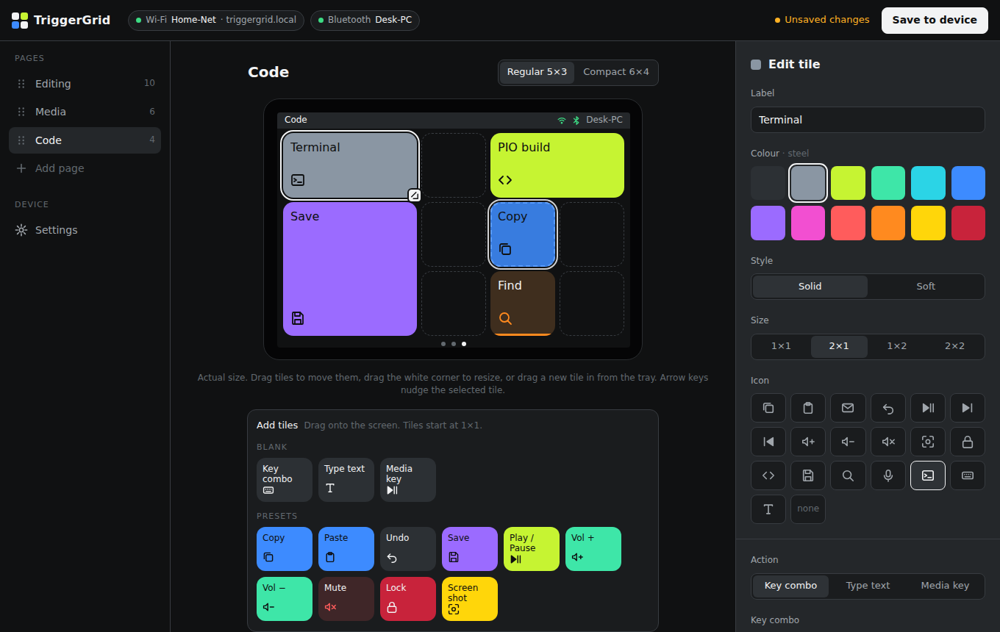
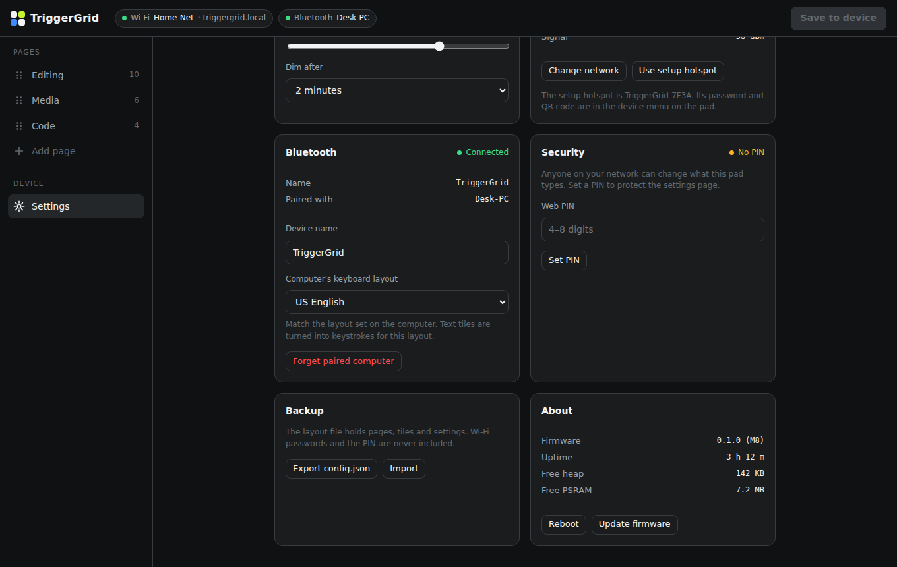
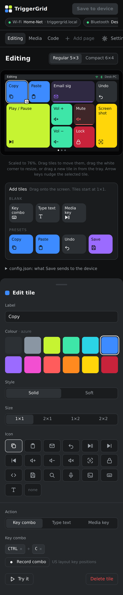

# Mockups

## Web config page: `web-config.html`

A clickable mockup of the page the device serves at `http://triggergrid.local` (roadmap M8/M9).
Open the file in any browser. It is a single file with no build step and no internet access
needed. In VS Code, right-click the file and choose *Reveal in File Explorer* / *Finder*, then
double-click it. Add `#settings` to the URL to open the settings view directly.

| Settings view | Phone layout |
|---|---|
|  |  |

**What works in the mockup:**
- **Drag and drop on the preview:**
  - drag a blank tile or a preset from the *Add tiles* tray onto the screen;
  - drag a tile to move it, and drag the white corner handle of the selected tile to resize it;
  - drag a tile back onto the tray to delete it;
  - a dashed outline shows where the tile will land. It turns red if the spot is taken or off the
    grid, and dropping there does nothing;
  - arrow keys move the focused tile one cell.
- Switch pages, add a page, rename the page (the name updates in the preview's status bar).
- Tap a tile to edit its label, colour, style (solid / soft), size, icon and action. The preview
  updates as you go.
- Tap an empty `+` cell to add a blank tile there, or delete a tile from the editor.
- All placement follows the grid rules from the config schema (must fit the grid, no overlaps).
- **Record combo:** press a key combination and it's converted to config key names (`CTRL`, `SHIFT`, `M`).
- Switch density between Regular 5×3 and Compact 6×4.
- *config.json for this page* shows the live JSON in the [config schema](../config-schema.md) format.

**What's faked:** nothing is sent to a device. *Save*, *Try it* and the Wi-Fi, Bluetooth and backup
buttons only show a message. Status values (IP, signal, heap) are placeholders.

**How it maps to the real page:** the real `web/index.html` (M8/M9) can start from this file. The
data model, grid maths, swatch table and key-name mapping are already the ones the firmware will
use. What changes is loading and saving through `GET`/`PUT /api/config`, and compiling the
`pad` section before saving (see the [config schema](../config-schema.md#the-pad-section-compiled)).
The *config.json* panel in the mockup shows the `editor` section.

**Design notes:**
- The device preview is drawn at 1:1 (480×320 plus bezel) using the style-guide grid numbers, and
  scales down only when the screen is narrower than that.
- The interface is neutral graphite. The only colour is in the tiles and the status dots, and the
  primary button is white, as the style guide specifies.
- Fonts fall back to system fonts here. The real page will self-host Space Grotesk and JetBrains
  Mono subsets in `web/fonts/`, embedded in the firmware.

To refresh the screenshots after changing the mockup, render it in a browser (desktop at
1360×860, phone at 390 px wide) and save the images over the files in `docs/images/`. The
drag screenshot is taken while dragging the *Copy* preset over an empty cell on the *Code* page.
